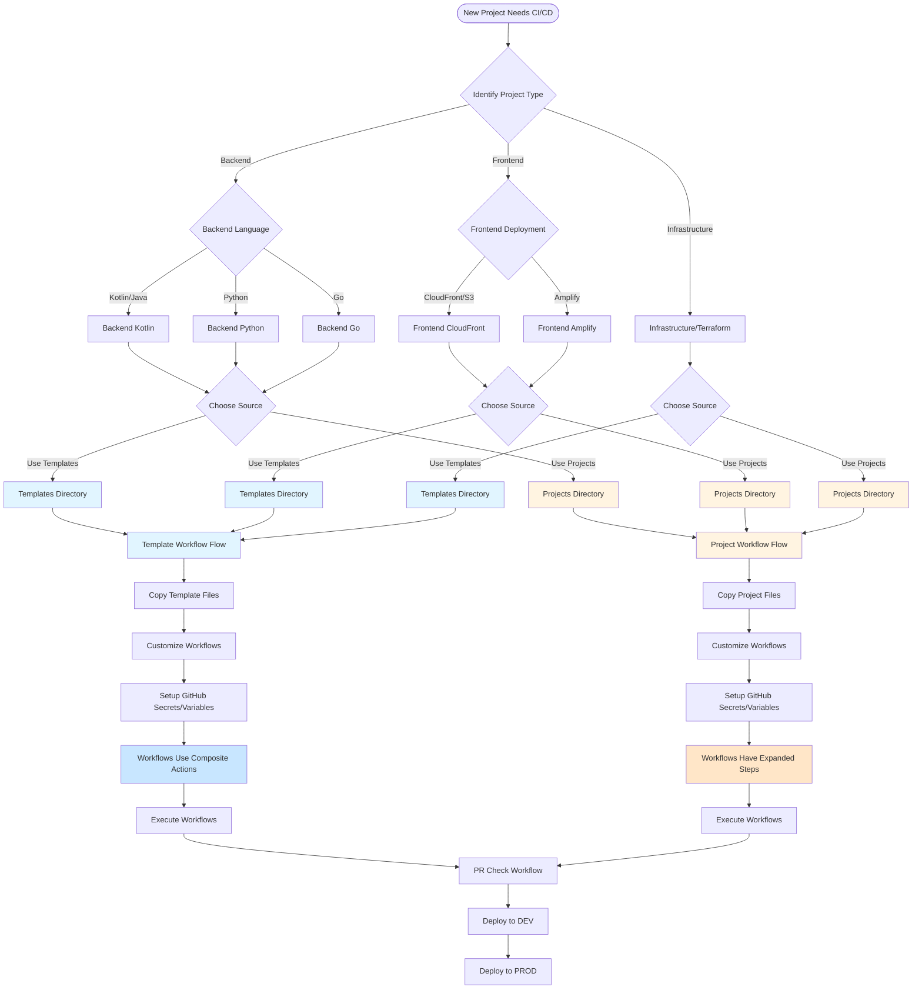
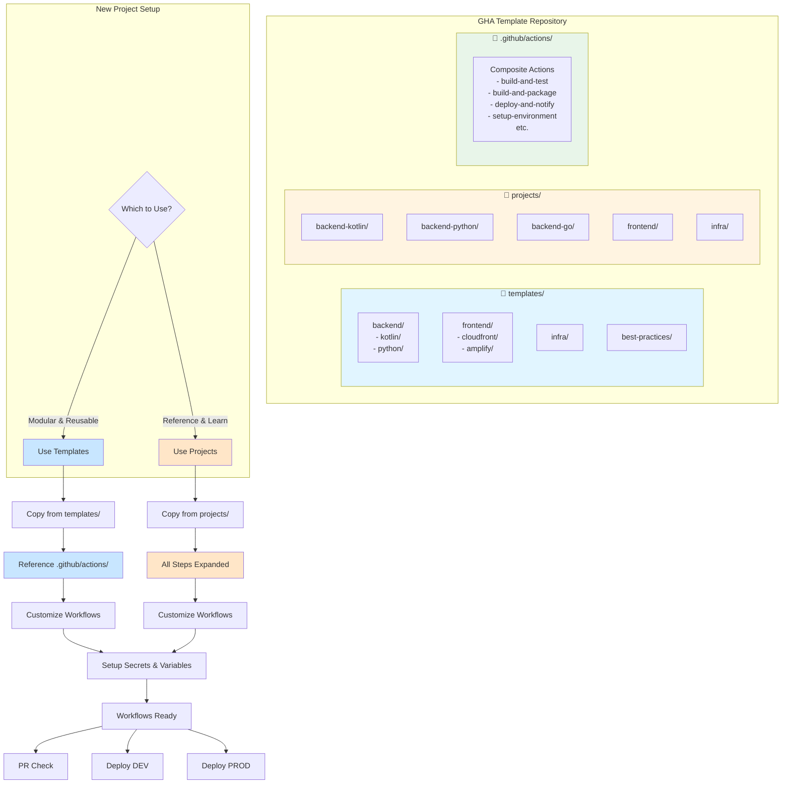
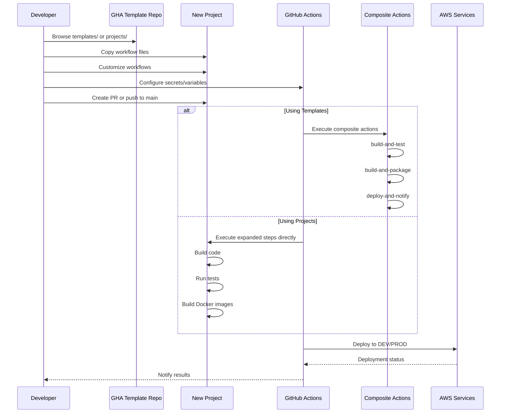
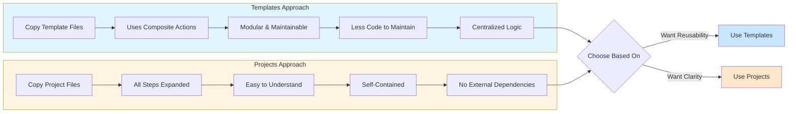

# GitHub Actions Template Repository Flow

## Repository Structure and Usage Flow

```mermaid
flowchart TD
    Start([New Project Needs CI/CD]) --> Identify{Identify Project Type}
    
    Identify -->|Backend| BackendType{Backend Language}
    Identify -->|Frontend| FrontendType{Frontend Deployment}
    Identify -->|Infrastructure| Infra[Infrastructure/Terraform]
    
    BackendType -->|Kotlin/Java| BackendKotlin[Backend Kotlin]
    BackendType -->|Python| BackendPython[Backend Python]
    BackendType -->|Go| BackendGo[Backend Go]
    
    FrontendType -->|CloudFront/S3| FrontendCloudFront[Frontend CloudFront]
    FrontendType -->|Amplify| FrontendAmplify[Frontend Amplify]
    
    BackendKotlin --> ChooseBackend{Choose Source}
    BackendPython --> ChooseBackend
    BackendGo --> ChooseBackend
    FrontendCloudFront --> ChooseFrontend{Choose Source}
    FrontendAmplify --> ChooseFrontend
    Infra --> ChooseInfra{Choose Source}
    
    ChooseBackend -->|Use Templates| TemplatesBackend[Templates Directory]
    ChooseBackend -->|Use Projects| ProjectsBackend[Projects Directory]
    
    ChooseFrontend -->|Use Templates| TemplatesFrontend[Templates Directory]
    ChooseFrontend -->|Use Projects| ProjectsFrontend[Projects Directory]
    
    ChooseInfra -->|Use Templates| TemplatesInfra[Templates Directory]
    ChooseInfra -->|Use Projects| ProjectsInfra[Projects Directory]
    
    TemplatesBackend --> TemplateFlow[Template Workflow Flow]
    TemplatesFrontend --> TemplateFlow
    TemplatesInfra --> TemplateFlow
    
    ProjectsBackend --> ProjectFlow[Project Workflow Flow]
    ProjectsFrontend --> ProjectFlow
    ProjectsInfra --> ProjectFlow
    
    TemplateFlow --> CopyTemplate[Copy Template Files]
    CopyTemplate --> CustomizeTemplate[Customize Workflows]
    CustomizeTemplate --> SetupSecrets[Setup GitHub Secrets/Variables]
    SetupSecrets --> UseCompositeActions[Workflows Use Composite Actions]
    UseCompositeActions --> ExecuteTemplate[Execute Workflows]
    
    ProjectFlow --> CopyProject[Copy Project Files]
    CopyProject --> CustomizeProject[Customize Workflows]
    CustomizeProject --> SetupSecrets2[Setup GitHub Secrets/Variables]
    SetupSecrets2 --> UseExpandedSteps[Workflows Have Expanded Steps]
    UseExpandedSteps --> ExecuteProject[Execute Workflows]
    
    ExecuteTemplate --> PRCheck[PR Check Workflow]
    ExecuteProject --> PRCheck
    PRCheck --> DeployDev[Deploy to DEV]
    DeployDev --> DeployProd[Deploy to PROD]
    
    style TemplatesBackend fill:#e1f5ff
    style TemplatesFrontend fill:#e1f5ff
    style TemplatesInfra fill:#e1f5ff
    style ProjectsBackend fill:#fff4e1
    style ProjectsFrontend fill:#fff4e1
    style ProjectsInfra fill:#fff4e1
    style TemplateFlow fill:#e1f5ff
    style ProjectFlow fill:#fff4e1
    style UseCompositeActions fill:#c8e6ff
    style UseExpandedSteps fill:#ffe6c8
```

## Detailed Component Flow

```mermaid
graph TB
    subgraph Repository["GHA Template Repository"]
        subgraph Templates["📁 templates/"]
            TBackend["backend/<br/>- kotlin/<br/>- python/"]
            TFrontend["frontend/<br/>- cloudfront/<br/>- amplify/"]
            TInfra["infra/"]
            TBestPractices["best-practices/"]
        end
        
        subgraph Projects["📁 projects/"]
            PBackendKotlin["backend-kotlin/"]
            PBackendPython["backend-python/"]
            PBackendGo["backend-go/"]
            PFrontend["frontend/"]
            PInfra["infra/"]
        end
        
        subgraph Actions["📁 .github/actions/"]
            CompositeActions["Composite Actions<br/>- build-and-test<br/>- build-and-package<br/>- deploy-and-notify<br/>- setup-environment<br/>etc."]
        end
    end
    
    subgraph NewProject["New Project Setup"]
        Decision{Which to Use?}
        Decision -->|Modular & Reusable| UseTemplates[Use Templates]
        Decision -->|Reference & Learn| UseProjects[Use Projects]
    end
    
    UseTemplates --> CopyTemplates[Copy from templates/]
    CopyTemplates --> RefActions[Reference .github/actions/]
    RefActions --> CustomizeT[Customize Workflows]
    
    UseProjects --> CopyProjects[Copy from projects/]
    CopyProjects --> ExpandSteps[All Steps Expanded]
    ExpandSteps --> CustomizeP[Customize Workflows]
    
    CustomizeT --> SetupConfig[Setup Secrets & Variables]
    CustomizeP --> SetupConfig
    
    SetupConfig --> Workflows[Workflows Ready]
    
    Workflows --> PR[PR Check]
    Workflows --> DeployDev[Deploy DEV]
    Workflows --> DeployProd[Deploy PROD]
    
    style Templates fill:#e1f5ff
    style Projects fill:#fff4e1
    style Actions fill:#e8f5e9
    style UseTemplates fill:#c8e6ff
    style UseProjects fill:#ffe6c8
    style RefActions fill:#c8e6ff
    style ExpandSteps fill:#ffe6c8
```

## Workflow Execution Flow

```mermaid
sequenceDiagram
    participant Dev as Developer
    participant Repo as GHA Template Repo
    participant NewProj as New Project
    participant GitHub as GitHub Actions
    participant Actions as Composite Actions
    participant AWS as AWS Services
    
    Dev->>Repo: Browse templates/ or projects/
    Dev->>NewProj: Copy workflow files
    Dev->>NewProj: Customize workflows
    Dev->>GitHub: Configure secrets/variables
    Dev->>NewProj: Create PR or push to main
    
    alt Using Templates
        GitHub->>Actions: Execute composite actions
        Actions->>Actions: build-and-test
        Actions->>Actions: build-and-package
        Actions->>Actions: deploy-and-notify
    else Using Projects
        GitHub->>NewProj: Execute expanded steps directly
        NewProj->>NewProj: Build code
        NewProj->>NewProj: Run tests
        NewProj->>NewProj: Build Docker images
    end
    
    GitHub->>AWS: Deploy to DEV/PROD
    AWS-->>GitHub: Deployment status
    GitHub-->>Dev: Notify results
```

## Template vs Project Comparison

```mermaid
graph LR
    subgraph Templates["Templates Approach"]
        T1[Copy Template Files] --> T2[Uses Composite Actions]
        T2 --> T3[Modular & Maintainable]
        T3 --> T4[Less Code to Maintain]
        T4 --> T5[Centralized Logic]
    end
    
    subgraph Projects["Projects Approach"]
        P1[Copy Project Files] --> P2[All Steps Expanded]
        P2 --> P3[Easy to Understand]
        P3 --> P4[Self-Contained]
        P4 --> P5[No External Dependencies]
    end
    
    T5 --> Decision{Choose Based On}
    P5 --> Decision
    
    Decision -->|Want Reusability| UseTemplates[Use Templates]
    Decision -->|Want Clarity| UseProjects[Use Projects]
    
    style Templates fill:#e1f5ff
    style Projects fill:#fff4e1
    style UseTemplates fill:#c8e6ff
    style UseProjects fill:#ffe6c8
```
